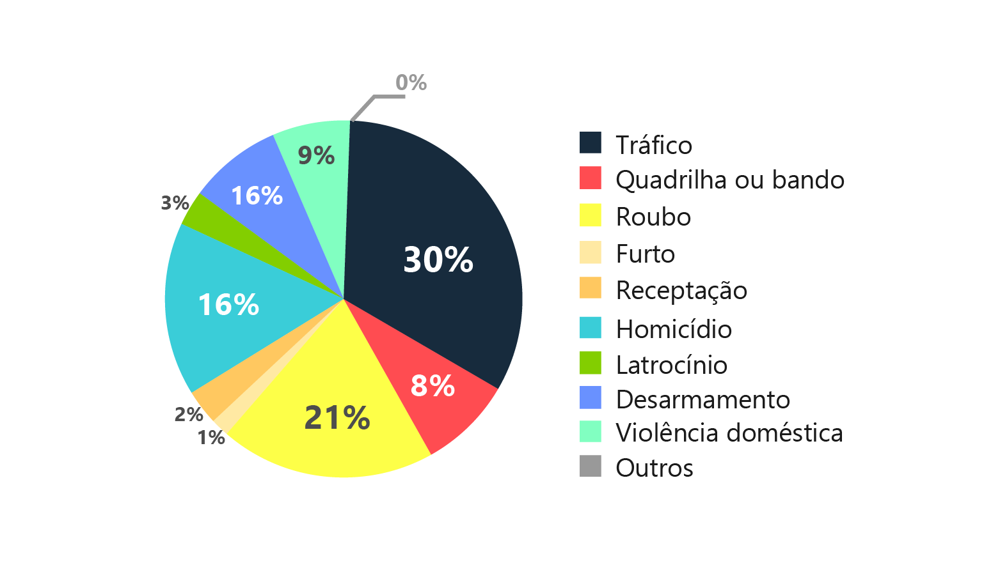
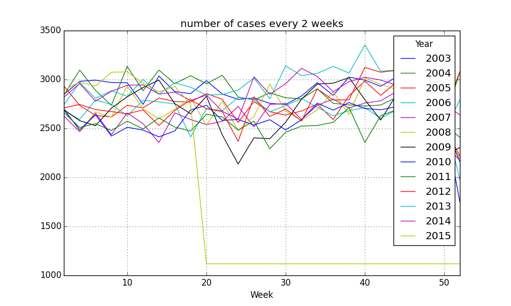
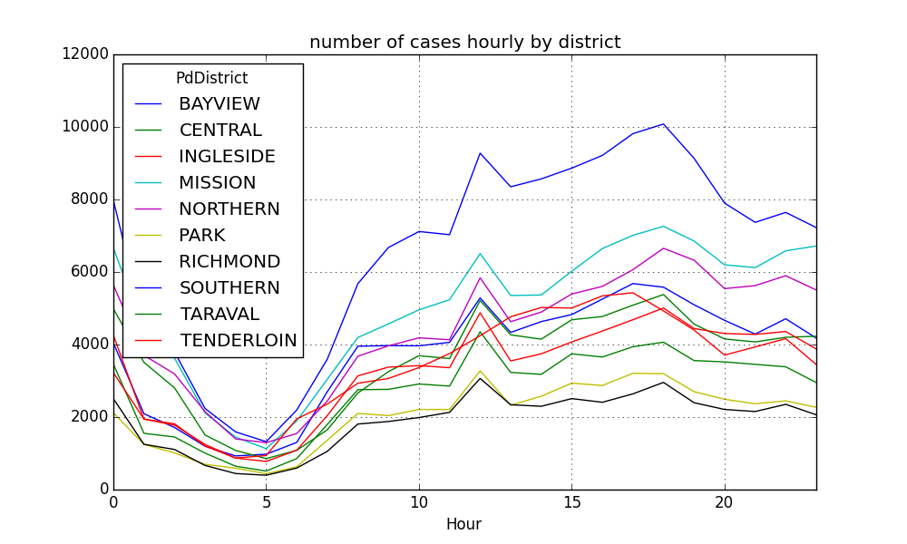

# Nanodegree Engenheiro de Machine Learning
## Proposta de projeto final
Gabriel Yan Mitoso

30 de setembro de 2018

## Proposta

### Histórico do assunto
Já não é mais novidade que a criminalidade no Brasil possui níveis acima da média mundial, com níveis particulamente altos para crimes a mão armada e homicídios, onde em sua maioria o narcotráfico está envolvido. Apesar da Constituição Brasileira estabelecer cinco instituições policiais diferentes, todas estão com equipamentos sucateados e déficit em seus efetivos.

Como se não bastasse a alta taxa de criminalidade e as policias sucateadas, a taxa de ocupação dos presídios brasileiros é de 175%, sendo o Brasil, o terceiro país com mais presos no mundo. A imagem a seguir mostra a distribuição dos crimes no sistema federal.

Como cidadão brasileiro que vive com o medo constante de ser assaltado, acredito que o tema é de suma importância.

### Descrição do problema
Com os dados fornecidos pelo Secretaria Nacional de Segurança Pública, o objetivo do problema é prever a categoria do crime no estado de São Paulo, baseado na cidade, mês, ano e quantidade de ocorrências. Sendo um objetivo também, explorar os dados visualmente, obtendo-se diferentes gráficos.

### Conjuntos de dados e entradas
Os dados que serão utilizados neste problema foram fornecidos pela [Secretaria Nacional de Segurança Pública](http://dados.mj.gov.br/dataset/sistema-nacional-de-estatisticas-de-seguranca-publica). O conjunto de dados trata da contabilização do número de ocorrências registradas, para cada cidade, mês e ano considerado.

Para o escopo deste problema considerei apenas o estado de São Paulo e os anos de 2015 a 2017. A tabela a seguir apresenta a descrição dos dados:

<table>
<th>Atributo</th>
<th>Descrição</th>
<tr>
<td>Código IBGE do Município</td>
<td>Código de identificação do município utilizado pelo IBGE.</td>
</tr>
<tr>
<tr>
<td>Município</td>
<td>Cidade das ocorrências</td>
</tr>
<td>Tipo Crime</td>
<td>Categoria do crime</td>
</tr>
<tr>
<td>Mês</td>
<td>Mês das ocorrências, representados de 1 a 12.</td>
</tr>
<tr>
<td>Ano</td>
<td>Ano das ocorrências</td>
</tr>
<tr>
<td>Qtde de Ocorrências</td>
<td>Quantidade de ocorrências</td>
</tr>
</table>

### Descrição da solução
Neste problema de classificação temos que as ocorrências podem ter probabilidades de pertencer a determinada categoria, então utilizar o algoritmo de [K-Nearest Neighbors](http://scikit-learn.org/stable/modules/generated/sklearn.neighbors.KNeighborsClassifier.html#sklearn.neighbors.KNeighborsClassifier) deve nos trazer bons resultados. Mas também podemos explorar o algoritmo de [Regressão Logística](http://scikit-learn.org/stable/modules/generated/sklearn.linear_model.LogisticRegression.html).

### Modelo de referência (benchmark)
A ideia deste problema veio com base no problema [San Francisco Crime Classification](https://www.kaggle.com/c/sf-crime) da Kaggle. Nele temos dados parecidos, como: local, data e categoria, e o objetivo também é prever a categoria do crime. A Kaggle utiliza a métrica de [Log Loss](http://scikit-learn.org/stable/modules/generated/sklearn.metrics.log_loss.html) para avaliar os modelos submetidos.

### Métricas de avaliação
Assim como a Kaggle, pretendo utilizar a métrica de [Log Loss](http://scikit-learn.org/stable/modules/generated/sklearn.metrics.log_loss.html), onde será analisado a performance baseado nas probabilidades e o valor real. Considerando apenas uma categoria, a fórmula matemática de log loss é:
- l(y,p) = -ylog (p) + (y-1)log (1-p)

Onde y é o valor real e p é o valor previsto.

### Design do projeto
O primeiro passo será explorar os dados, apresentando quantidade de colunas e linhas, mostrando as primeiras linhas, descrevendo cada atributo e retirando colunas que não seriam utilizadas.

No segundo passo exploraria os dados visualmente, obtendo gráficos como os abaixo:

No primeiro gráfico temos o número de casos a cada 2 semanas, neste caso obterei o número de casos a cada mês. No segundo gráfico temos o número de casos a cada hora por distrito, neste caso poderei obter o número de casos a cada mês por cidade.

O terceiro passo será para pré processar os dados, identificando e analisando possíveis outliers, determinando se devem ser excluídos. Após excluir os outliers, tranformarei os dados não numéricos para facilitar o processamento. Ao final dividirei os dados em dados de teste e de treino.

O quarto passo será para explorar os modelos propostos, [K-Nearest Neighbors](http://scikit-learn.org/stable/modules/generated/sklearn.neighbors.KNeighborsClassifier.html#sklearn.neighbors.KNeighborsClassifier) e [Regressão Logística](http://scikit-learn.org/stable/modules/generated/sklearn.linear_model.LogisticRegression.html). Para decidir os melhores parâmetros utilizarei
[GridSearchCV](http://scikit-learn.org/stable/modules/generated/sklearn.model_selection.GridSearchCV.html).

O último passo seria para analisar o score obtido da métrica de [Log Loss](http://scikit-learn.org/stable/modules/generated/sklearn.metrics.log_loss.html), fazer as considerações sobre o resultado obtido e possíveis trabalhos futuros.

### Referências
- http://www.justica.gov.br/news/ha-726-712-pessoas-presas-no-brasil
- http://www.cnmp.mp.br/portal/todas-as-noticias/11314-taxa-de-ocupacao-dos-presidios-brasileiros-e-de-175-mostra-relatorio-dinamico-sistema-prisional-em-numeros
- http://www.ipea.gov.br/atlasviolencia/
- https://www.kaggle.com/c/sf-crime
- https://www.kaggle.com/wendykan/don-t-know-what-i-want-to-do-yet
