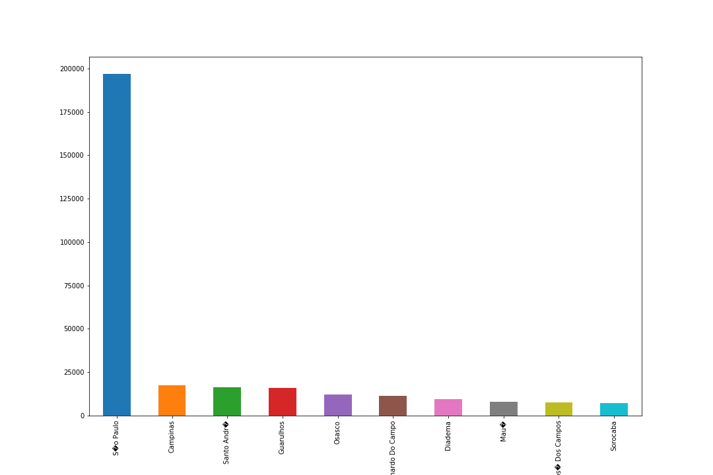
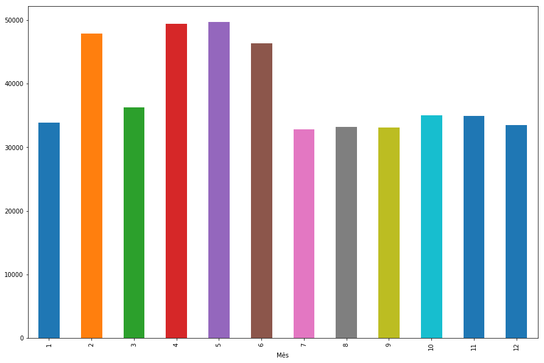
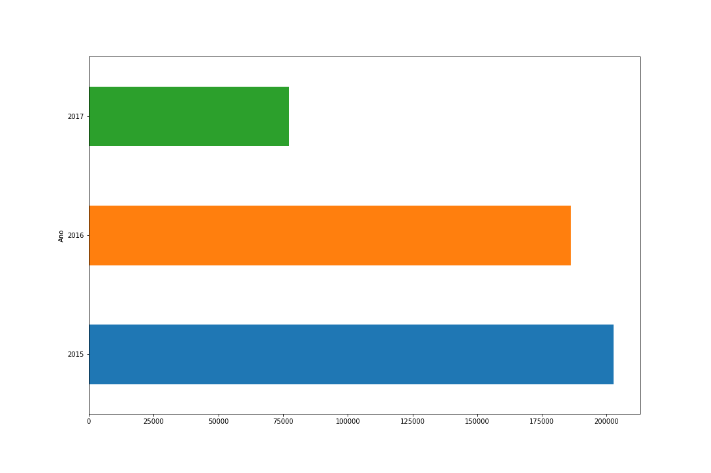
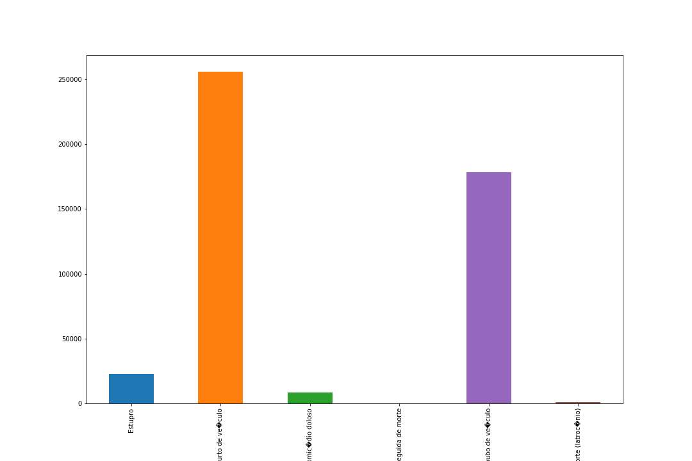

# Nanodegree Engenheiro de Machine Learning
## Projeto final
Gabriel Yan Mitoso

21 de Outubro de 2018

## I. Definição

### Visão geral do projeto
A criminalidade no Brasil possui níveis acima da média mundial, com níveis particulamente altos para crimes a mão armada e homicídios, onde em sua maioria o narcotráfico está envolvido. Quando algum crime ocorre, um boletim de ocorrência é registrado e nele temos a categoria do crime que foi cometido.

Este trabalho busca através dos registros de ocorrências dos anos de 2015 a 2017, fornecidos pela [Secretaria Nacional de Segurança Pública](http://dados.mj.gov.br/dataset/sistema-nacional-de-estatisticas-de-seguranca-publica), prever a categoria do crime no estado de São Paulo.

### Descrição do problema
O objetivo do problema é prever a categoria do crime no estado de São Paulo, utilizando os registros de ocorrências. E para alcançar este objetivo as seguintes tarefas serão aplicadas:
1. Explorar os dados, apresentando quantidade de colunas e linhas, mostrando as primeiras linhas e descrevendo cada atributo.
2. Gerar diferentes histogramas para análise.
3. Pré processar os dados, identificando e analisando possíveis outliers.
4. Dividir os dados em teste e treino.
5. Aplicar e otimizar o algoritmo [K-Nearest Neighbors](http://scikit-learn.org/stable/modules/generated/sklearn.neighbors.KNeighborsClassifier.html#sklearn.neighbors.KNeighborsClassifier) e [Regressão Logística](http://scikit-learn.org/stable/modules/generated/sklearn.linear_model.LogisticRegression.html).
6. Aplicar e otimizar o algoritmo [Regressão Logística](http://scikit-learn.org/stable/modules/generated/sklearn.linear_model.LogisticRegression.html).
7. Escolher o melhor algoritmo a partir do score obtido da métrica de [Log Loss](http://scikit-learn.org/stable/modules/generated/sklearn.metrics.log_loss.html).

Ao final espera-se que o modelo escolhido seja capaz de prever a categoria do crime, baseado na cidade, mês, ano e quantidade de ocorrências.

### Métricas
A métrica de [Log Loss](http://scikit-learn.org/stable/modules/generated/sklearn.metrics.log_loss.html) analisa a performance baseado nas probabilidades e o valor real. Considerando apenas uma categoria, a fórmula matemática de log loss é:
- l(y,p) = -ylog (p) + (y-1)log (1-p)

Onde y é o valor real e p é o valor previsto.

Neste problema de classificação, temos que as ocorrências podem ter probabilidades de pertencer a determinada categoria de crime, então utilizar [Log Loss](http://scikit-learn.org/stable/modules/generated/sklearn.metrics.log_loss.html) é uma boa escolha, visto que o score é diminuido a cada categoria mal prevista.

## II. Análise

### Exploração dos dados
Os dados utilizados neste problema foram fornecidos pela [Secretaria Nacional de Segurança Pública](http://dados.mj.gov.br/dataset/sistema-nacional-de-estatisticas-de-seguranca-publica). O conjunto de dados trata da contabilização do número de ocorrências registradas, para cada cidade, mês e ano considerado.

Para o escopo deste problema foi considerado apenas o estado de São Paulo e os anos de 2015 a 2017. A tabela a seguir apresenta a descrição dos dados:

<table>
<th>Atributo</th>
<th>Descrição</th>
<tr>
<td>Código IBGE do Município</td>
<td>Código de identificação do município utilizado pelo IBGE.</td>
</tr>
<tr>
<tr>
<td>Município</td>
<td>Cidade das ocorrências</td>
</tr>
<td>Tipo Crime</td>
<td>Categoria do crime</td>
</tr>
<tr>
<td>Mês</td>
<td>Mês das ocorrências, representados de 1 a 12.</td>
</tr>
<tr>
<td>Ano</td>
<td>Ano das ocorrências</td>
</tr>
<tr>
<td>Qtde de Ocorrências</td>
<td>Quantidade de ocorrências</td>
</tr>
</table>

A tabela a seguir apresenta as primeiras linha do arquivo csv obtido.
<br>
<br>
<table>
<th>Código IBGE Município</th>
<th>Município</th>
<th>Tipo Crime</th>
<th>Mês</th>
<th>Ano</th>
<th>Qtde Ocorrências</th>
<tr>
<td>3500105</td>
<td>Adamantina</td>
<td>Estupro</td>
<td>2</td>
<td>2015</td>
<td>1</td>
</tr>
<tr>
<tr>
<td>3500105</td>
<td>Adamantina</td>
<td>Estupro</td>
<td>2</td>
<td>2015</td>
<td>1</td>
</tr>
<tr>
<tr>
<td>3500105</td>
<td>Adamantina</td>
<td>Estupro</td>
<td>11</td>
<td>2015</td>
<td>1</td>
</tr>
<tr>
<tr>
<td>3500105</td>
<td>Adamantina</td>
<td>Furto de veículo</td>
<td>2</td>
<td>2015</td>
<td>1</td>
</tr>
<tr>
<tr>
<td>3500105</td>
<td>Adamantina</td>
<td>Furto de veículo</td>
<td>3</td>
<td>2015</td>
<td>2</td>
</tr>
<tr>
</table>

Após ler o arquivo csv, obtive algumas informações sobre o mesmo:
- Número total de registros: 24550
- Número de atributos: 5
- Número de categorias de crime: 6
- Número de cidades: 626

O número de atributos não está correto, pois a biblioteca pandas não indexou todas as colunas.

### Visualização exploratória
Por se tratar de um problema real e com dados reais, a visualização e compreensão dos dados é um dos objetivos deste trabalho. O primeiro gráfico a ser obtido é o das cidades com o maior número de ocorrências, e como esperado São Paulo apresenta uma quantidade bem mais significativa do que as outras cidades, chegando a quase 200 mil ocorrências.



No segundo gráfico temos a quantidade de ocorrências para cada mês do ano. Neste gŕafico 4 meses se destacaram pelo maior número de ocorrências: Fevereiro, Abril, Maio e Junho.



O terceiro gráfico trás o número de ocorrências por ano. Os dados de 2017 não estão completos, o que desbalanceou o gráfico, mas percebemos que em 2016 o número de ocorrências diminui consideravelmente.



O último gráfico obtido trás a quantidade de ocorrências para cada categoria de crime. Duas categorias de crime se destacam: Furto de veículo e Roubo de veículo, ambas com um número consideravelmente maior que as outras categorias.



### Algoritmos e técnicas
Neste trabalho dois algoritmos serão explorados e alguns pontos sobre os mesmos são discutidos:

##### Regressão Logística
- Modelo bastante utilizado para identificação de grupos, seja na medicina para identificar um grupo de indivíduos doentes, ou em instituições financeiras para identificar grupos de risco para subscrição de crédito.
- Com este modelo não precisamos nos preocupar com a relação entre os atributos e por ser um modelo facilmente regulável, se torna tolerante a ruídos nos dados, evitando sobreajuste.
- Se os atributos não forem linearmente separáveis o modelo não terá uma boa perfomance.
- Por ser regulável e de fácil implementação o modelo se apresenta um bom canditato ao problema.

##### K-Nearest Neighbors
- Modelo muito utilizado para problemas de classificação, previsões de estrutura 3D, Interações proteína-proteína, etc.
- Este modelo possui fácil implementação e consegue lidar com problemas de classificação e regressão.
- Para dados com muita dimensão o modelo têm baixa perfomance e em qualquer problema é necessário refinar os seus parâmetros.
- Como os dados utilizados são de baixa dimensão, este modelo também se apresenta um bom canditato ao problema.

Após dividir o conjunto de dados em treino e teste, aplicarei os modelos propostos, [K-Nearest Neighbors](http://scikit-learn.org/stable/modules/generated/sklearn.neighbors.KNeighborsClassifier.html#sklearn.neighbors.KNeighborsClassifier) e [Regressão Logística](http://scikit-learn.org/stable/modules/generated/sklearn.linear_model.LogisticRegression.html). Para refinar os parâmetros utilizarei
[GridSearchCV](http://scikit-learn.org/stable/modules/generated/sklearn.model_selection.GridSearchCV.html).

### Benchmark
A ideia deste problema veio com base no problema [San Francisco Crime Classification](https://www.kaggle.com/c/sf-crime) da Kaggle. Nele temos dados parecidos, como: local, data e categoria, e o objetivo também é prever a categoria do crime. A Kaggle utiliza a métrica de [Log Loss](http://scikit-learn.org/stable/modules/generated/sklearn.metrics.log_loss.html) para avaliar os modelos submetidos. O objetivo é chegar um valor de Log Loss aproximado aos submetidos.

## III. Metodologia

### Pré-processamento de dados
Os processamentos realizados no conjunto de dados são remover possíveis registros com a categoria de crime vazia, substituir as categorias por números e ao final remover as colunas que não serão utilizadas. Outros processamentos não foram necessários, visto que os dados estão bem ajustados. Ao final do pré processamento dos dados foram divididos 80% para treino e 20% para teste.

### Implementação
Os modelos utilizados são de fácil implementação e além da métrica de Log Loss, a pontuação F1 e acurácia também foram obtidas.

##### Regressão Logística
- <strong>F1</strong>: 0.191974615632
- <strong>Acurácia</strong>: 0.36150712831
- <strong>Log Loss</strong>: 1.79175946923

##### K-Nearest Neighbors
- <strong>F1</strong>: 0.451454935708
- <strong>Acurácia</strong>: 0.456822810591
- <strong>Log Loss</strong>: 1.79842892278

Apesar dos algoritmos escolhidos não necessitarem de um pré processamento para os dados, a métrica Log Loss necessita que para cada categoria tenha uma previsão, então foi necessário fazer uma função que recebe a previsão dos algoritmos e retorna no formato para inserir na métrica.

```python
# função para retornar no formato que a métrica log loss irá utilizar
def resultFrame(predictions):
    result_dataframe = pd.DataFrame({
        "Id": X_test["Código IBGE Município"]
    })
    for key,value in data_dict_new.items():
        result_dataframe[key] = 0
    count = 0
    for item in predictions:
        for key,value in data_dict.items():
            if(value == item):
                result_dataframe[key][count] = 1
        count+=1
    return result_dataframe
```

### Refinamento
Para a solução inicial os parâmetros 'default' foram utilizados. Para refinar esses parâmetros a técnica GridSearchCV foi utilizada, onde no modelo de Regressão Logística os parâmetros 'tol' e 'C' foram refinados e no modelo K-Nearest-Neighbors os parâmetros 'n_neighbors' e 'weights' foram refinados. A pontuação escolhida como parâmetro do GridSearchCV foi a F1, pois na métrica Log Loss necessita-se fazer a transformação da previsão.

Mesmo após o refinamento as pontuações permaneceram as mesmas.


## IV. Resultados

### Modelo de avaliação e validação
A técnica GridSearchCV retornou os melhores parâmetros, sendo os 'defaults' (que já são utilizados pelos algoritmos) os melhores. Para variar um pouco as entradas modifiquei o parâmetro 'random_state' dá função train_test_split, e os resultados obtidos foram semelhantes aos apresentados.

### Justificativa
Analisando a pontuação F1 e acurácia o algoritmo não se saiu tão bem e utilizá-lo na vida real não seria viável, mas se compararmos aos primeiros colocados do problema [San Francisco Crime Classification](https://www.kaggle.com/c/sf-crime), os algoritmos se saíram bem, onde o primeiro colocado da Kaggle tem a pontuação de 1.95936. Obviamente não se pode dizer que os algoritmos apresentados se saíram melhor, mas sim que um resultado satisfatório foi encontrado.


## V. Conclusão

### Foma livre de visualização

A tabela a seguir apresenta a correlação entre os atributos utilizados para teste, obtida utilizando a função [corr](https://pandas.pydata.org/pandas-docs/stable/generated/pandas.DataFrame.corr.html).

<table>
<th></th>
<th>Código IBGE Município</th>
<th>Mês</th>
<th>Ano</th>
<th>Qtde Ocorrências</th>
<tr>
<th>Código IBGE Município</th>
<td>1.000000</td>
<td>-0.003562</td>
<td>0.002353</td>
<td>0.072456</td>
</tr>
<tr>
<th>Mês</th>
<td>-0.003562</td>
<td>1.000000</td>
<td>-0.235237</td>
<td>0.000829</td>
</tr>
<tr>
<th>Ano</th>
<td>0.002353</td>
<td>-0.235237</td>
<td>1.000000</td>
<td>-0.002990</td>
</tr>
<th>Qtde Ocorrências</th>
<td>0.072456</td>
<td>0.000829</td>
<td>-0.002990</td>
<td>1.000000</td>
</tr>
</table>

Analisando a tabela descobrimos uma característica importante do conjunto de dados: os atributos não possuem correlação entre si. Esta característica nos ajuda na escolha de algoritmos que podem ser utilizados no futuro.

### Reflexão
O trabalho proposto foi baseado no problema [San Francisco Crime Classification](https://www.kaggle.com/c/sf-crime) da Kaggle, onde, após encontrar um conjunto de dados semelhante ao problema e referente as ocorrências brasileiras, obtive interesse pelo problema. Então, após obter os dados da Secretaria Nacional de Segurança Pública, explorei o conjunto de dados para obter algumas informações sobre o mesmo e depois gerei alguns gráficos com o intuito de analisar o conjunto de dados de diferentes formas. Após pré processar os dados, utilizei os algoritmos de Regressão Logística e K-Nearest-Neighbors para a solução e a métrica Log Loss foi utilizada para validá-los. Ao final, para refinar os modelos, a técnica GridSearchCV foi utilizada.

Apesar do problem não ter nenhum aspecto difícil, analisar o conjunto de dados visualmente se mostrou muito interessante pela natureza do projeto. Verificou-se neste projeto que a maioria das ocorrências são de roubo ou furto de veículos e que a cidade de São Paulo possui um número muito elevado de ocorrências e que seus dados deveriam ser analisados separadamente.

Mesmo não obtendo resultados consistentes devido ao conjunto de dados, adotaria os mesmos procedimentos para solucionar problemas semelhantes.

### Melhorias
Apesar de melhorias poderem ser alcançadas nos algoritmos utilizados, acredito que outros algoritmos devam ser explorados, como [XgBoost](https://xgboost.readthedocs.io/en/latest/python/python_intro.html), o qual foi utilizado pelos competidores da Kaggle para solucionar o problema [San Francisco Crime Classification](https://www.kaggle.com/c/sf-crime).

Outra possibilidade seria a [Secretaria Nacional de Segurança Pública](http://dados.mj.gov.br/dataset/sistema-nacional-de-estatisticas-de-seguranca-publica) enriquecer o conjunto de dados com outras informações das ocorrências. Dessa forma as previsões poderiam melhorar e teriam mais formas de explorar o conjunto de dados.
