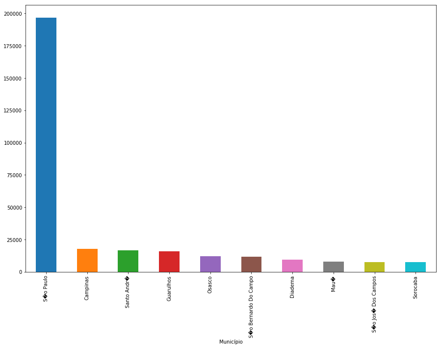
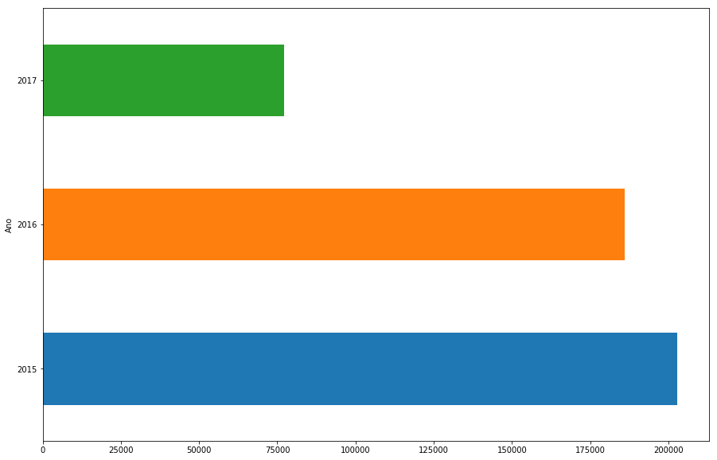
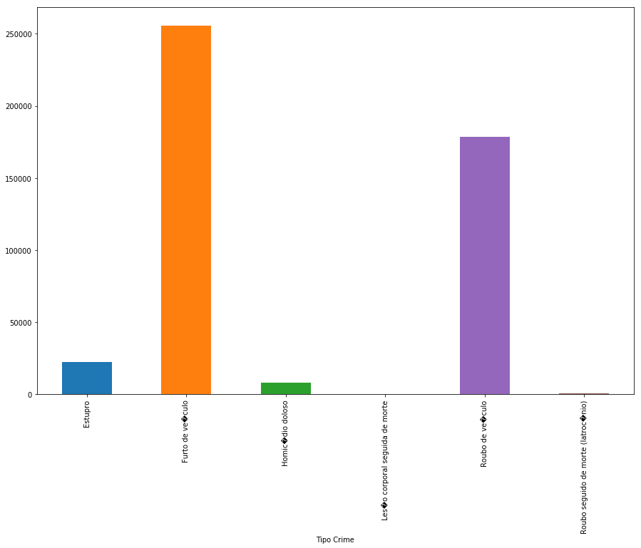

# Nanodegree Engenheiro de Machine Learning
## Projeto final
Gabriel Yan Mitoso

20 de Outubro de 2018

## I. Definição

### Visão geral do projeto
A criminalidade no Brasil possui níveis acima da média mundial, com níveis particulamente altos para crimes a mão armada e homicídios, onde em sua maioria o narcotráfico está envolvido. Quando algum crime ocorre, um boletim de ocorrência é registrado e nele temos a categoria do crime que foi cometido.

Este trabalho busca através dos registros de ocorrências dos anos de 2015 a 2017, fornecidos pela [Secretaria Nacional de Segurança Pública](http://dados.mj.gov.br/dataset/sistema-nacional-de-estatisticas-de-seguranca-publica), prever a categoria do crime no estado de São Paulo.

### Descrição do problema
O objetivo do problema é prever a categoria do crime no estado de São Paulo. Para alcançar este objetivo as seguintes tarefas serão aplicadas:
1. Explorar os dados, apresentando quantidade de colunas e linhas, mostrando as primeiras linhas e descrevendo cada atributo.
2. Gerar diferentes histogramas para análise.
3. Pré processar os dados, identificando e analisando possíveis outliers.
4. Dividir os dados em teste e treino.
5. Aplicar e otimizar o algoritmo [K-Nearest Neighbors](http://scikit-learn.org/stable/modules/generated/sklearn.neighbors.KNeighborsClassifier.html#sklearn.neighbors.KNeighborsClassifier) e [Regressão Logística](http://scikit-learn.org/stable/modules/generated/sklearn.linear_model.LogisticRegression.html).
6. Aplicar e otimizar o algoritmo [Regressão Logística](http://scikit-learn.org/stable/modules/generated/sklearn.linear_model.LogisticRegression.html).
7. Escolher o melhor algoritmo a partir do score obtido da métrica de [Log Loss](http://scikit-learn.org/stable/modules/generated/sklearn.metrics.log_loss.html).

Ao final espera-se que o modelo escolhido seja capaz de prever a categoria do crime, baseado na cidade, mês, ano e quantidade de ocorrências.

### Métricas
A métrica de [Log Loss](http://scikit-learn.org/stable/modules/generated/sklearn.metrics.log_loss.html) analisa a performance baseado nas probabilidades e o valor real. Considerando apenas uma categoria, a fórmula matemática de log loss é:
- l(y,p) = -ylog (p) + (y-1)log (1-p)

Onde y é o valor real e p é o valor previsto.

Neste problema de classificação, temos que as ocorrências podem ter probabilidades de pertencer a determinada categoria de crime, então utilizar [Log Loss](http://scikit-learn.org/stable/modules/generated/sklearn.metrics.log_loss.html) é uma boa escolha, visto que o score é diminuido a cada categoria mal prevista.

## II. Análise

### Exploração dos dados
Os dados utilizados neste problema foram fornecidos pela [Secretaria Nacional de Segurança Pública](http://dados.mj.gov.br/dataset/sistema-nacional-de-estatisticas-de-seguranca-publica). O conjunto de dados trata da contabilização do número de ocorrências registradas, para cada cidade, mês e ano considerado.

Para o escopo deste problema foi considerado apenas o estado de São Paulo e os anos de 2015 a 2017. A tabela a seguir apresenta a descrição dos dados:

<table>
<th>Atributo</th>
<th>Descrição</th>
<tr>
<td>Código IBGE do Município</td>
<td>Código de identificação do município utilizado pelo IBGE.</td>
</tr>
<tr>
<tr>
<td>Município</td>
<td>Cidade das ocorrências</td>
</tr>
<td>Tipo Crime</td>
<td>Categoria do crime</td>
</tr>
<tr>
<td>Mês</td>
<td>Mês das ocorrências, representados de 1 a 12.</td>
</tr>
<tr>
<td>Ano</td>
<td>Ano das ocorrências</td>
</tr>
<tr>
<td>Qtde de Ocorrências</td>
<td>Quantidade de ocorrências</td>
</tr>
</table>

A tabela a seguir apresenta as primeiras linha do arquivo csv obtido.

<table>
<th>Código IBGE Município</th>
<th>Município</th>
<th>Tipo Crime</th>
<th>Mês</th>
<th>Ano</th>
<th>Qtde Ocorrências</th>
<tr>
<td>3500105</td>
<td>Adamantina</td>
<td>Estupro</td>
<td>2</td>
<td>2015</td>
<td>1</td>
</tr>
<tr>
<tr>
<td>3500105</td>
<td>Adamantina</td>
<td>Estupro</td>
<td>2</td>
<td>2015</td>
<td>1</td>
</tr>
<tr>
<tr>
<td>3500105</td>
<td>Adamantina</td>
<td>Estupro</td>
<td>11</td>
<td>2015</td>
<td>1</td>
</tr>
<tr>
<tr>
<td>3500105</td>
<td>Adamantina</td>
<td>Furto de veículo</td>
<td>2</td>
<td>2015</td>
<td>1</td>
</tr>
<tr>
<tr>
<td>3500105</td>
<td>Adamantina</td>
<td>Furto de veículo</td>
<td>3</td>
<td>2015</td>
<td>2</td>
</tr>
<tr>
</table>

Após ler o arquivo csv, obtive algumas informações sobre o mesmo:
- Número total de registros: 24550
- Número de atributos: 5
- Número de categorias de crime: 6
- Número de cidades: 626

O número de atributos não está correto, pois a biblioteca pandas não indexou todas as colunas.

### Visualização exploratória
Por se tratar de um problema real e com dados reais, a visualização e compreensão dos dados é um dos objetivos deste trabalho. O primeiro gráfico a ser obtido é o das cidades com o maior número de ocorrências, e como esperado São Paulo apresenta uma quantidade bem mais significativa do que as outras cidades, chegando a quase 200 mil ocorrências.

No segundo gráfico temos a quantidade de ocorrências para cada mês do ano. Neste gŕafico 4 meses se destacaram pelo maior número de ocorrências: Fevereiro, Abril, Maio e Junho.

O terceiro gráfico trás o número de ocorrências por ano. Os dados de 2017 não estão completos, o que desbalanceou o gráfico, mas percebemos que em 2016 o número de ocorrências diminui consideravelmente.

O último gráfico obtido trás a quantidade de ocorrências para cada categoria de crime. Duas categorias de crime se destacam: Furto de veículo e Roubo de veículo, ambas com um número consideravelmente maior que as outras categorias.

### Algoritmos e técnicas
Neste trabalho dois algoritmos serão explorados:

##### Regressão Logística
- Modelo bastante utilizado para identificação de grupos, seja na medicina para identificar um grupo de indivíduos doentes, ou em instituições financeiras para identificar grupos de risco para subscrição de crédito.
- Com este modelo não precisamos nos preocupar com a relação entre os atributos e por ser um modelo facilmente regulável, se torna tolerante a ruídos nos dados, evitando sobreajuste.
- Se os atributos não forem linearmente separáveis o modelo não terá uma boa perfomance.
- Por ser regulável, o modelo pode se adaptar ao bom número de atributos do problema, evitando sobreajuste.

##### K-Nearest Neighbors

Nesta seção, você deverá discutir os algoritmos e técnicas que você pretende utilizar para solucionar o problema. Você deverá justificar o uso de cada algoritmo ou técnica baseado nas características do problema e domínio do problema. Questões para se perguntar ao escrever esta seção:
- _Os algoritmos que serão utilizados, incluindo quaisquer variáveis/parâmetros padrão do projeto, foram claramente definidos?_
- _As técnicas a serem usadas foram adequadamente discutidas e justificadas?_
- _Ficou claro como os dados de entrada ou conjuntos de dados serão controlados pelos algoritmos e técnicas escolhidas?_

### Benchmark
A ideia deste problema veio com base no problema [San Francisco Crime Classification](https://www.kaggle.com/c/sf-crime) da Kaggle. Nele temos dados parecidos, como: local, data e categoria, e o objetivo também é prever a categoria do crime. A Kaggle utiliza a métrica de [Log Loss](http://scikit-learn.org/stable/modules/generated/sklearn.metrics.log_loss.html) para avaliar os modelos submetidos. O objetivo é chegar um valor de Log Loss aproximado aos submetidos.

## III. Metodologia
_(aprox. 3-5 páginas)_

### Pré-processamento de dados
Nesta seção, você deve documentar claramente todos os passos de pré-processamento que você pretende fazer, caso algum seja necessário. A partir da seção anterior, quaisquer anormalidades ou características que você identificou no conjunto de dados deverão ser adequadamente direcionadas e tratadas aqui. Questões para se perguntar ao escrever esta seção:
- _Se os algoritmos escolhidos requerem passos de pré-processamento, como seleção ou transformações de atributos, tais passos foram adequadamente documentados?_
- _Baseado na seção de **Exploração de dados**, se existiram anormalidade ou características que precisem ser tratadas, elas foram adequadamente corrigidas?_
- _Se não é necessário um pré-processamento, foi bem definido o porquê?_

### Implementação
Nesta seção, o processo de escolha de quais métricas, algoritmos e técnicas deveriam ser implementados para os dados apresentados deve estar claramente documentado. Deve estar bastante claro como a implementação foi feita, e uma discussão deve ser elaborada a respeito de quaisquer complicações ocorridas durante o processo.  Questões para se perguntar ao escrever esta seção:
- _Ficou claro como os algoritmos e técnicas foram implementados com os conjuntos de dados e os dados de entrada apresentados?_
- _Houve complicações com as métricas ou técnicas originais que acabaram exigindo mudanças antes de chegar à solução?_
- _Houve qualquer parte do processo de codificação (escrita de funções complicadas, por exemplo) que deveriam ser documentadas?_

### Refinamento
Nesta seção, você deverá discutir o processo de aperfeiçoamento dos algoritmos e técnicas usados em sua implementação. Por exemplo, ajuste de parâmetros para que certos modelos obtenham melhores soluções está dentro da categoria de refinamento. Suas soluções inicial e final devem ser registradas, bem como quaisquer outros resultados intermediários significativos, conforme o necessário. Questões para se perguntar ao escrever esta seção:
- _Uma solução inicial foi encontrada e claramente reportada?_
- _O processo de melhoria foi documentado de foma clara, bem como as técnicas utilizadas?_
- _As soluções intermediárias e finais foram reportadas claramente, conforme o processo foi sendo melhorado?_

## IV. Resultados
_(aprox. 2-3 páginas)_

### Modelo de avaliação e validação
Nesta seção, o modelo final e quaisquer qualidades que o sustentem devem ser avaliadas em detalhe. Deve ficar claro como o modelo final foi obtido e por que tal modelo foi escolhido. Além disso, algum tipo de análise deve ser realizada para validar a robustez do modelo e sua solução, como, por exemplo, manipular os dados de entrada ou o ambiente para ver como a solução do modelo é afetada (técnica chamada de análise sensitiva). Questões para se perguntar ao escrever esta seção:
- _O modelo final é razoável e alinhado com as expectativas de solução? Os parâmetros finais do modelo são apropriados?_
- _O modelo final foi testado com várias entradas para avaliar se o modelo generaliza bem com dados não vistos?_
-_O modelo é robusto o suficiente para o problema? Pequenas perturbações (mudanças) nos dados de treinamento ou no espaço de entrada afetam os resultados de forma considerável?_
- _Os resultados obtidos do modelo são confiáveis?_

### Justificativa
Nesta seção, a solução final do seu modelo e os resultados dela obtidos devem ser comparados aos valores de referência (benchmark) que você estabeleceu anteriormente no projeto, usando algum tipo de análise estatística. Você deverá também justificar se esses resultados e a solução são significativas o suficiente para ter resolvido o problema apresentado no projeto. Questões para se perguntar ao escrever esta seção:
- _Os resultados finais encontrados são mais fortes do que a referência reportada anteriormente?_
- _Você analisou e discutiu totalmente a solução final?_
- _A solução final é significativa o suficiente para ter resolvido o problema?_

## V. Conclusão
_(aprox. 1-2 páginas)_

### Foma livre de visualização
Nesta seção, você deverá fornecer alguma forma de visualização que enfatize uma qualidade importante do projeto. A visualização é de forma livre, mas deve sustentar de forma razoável um resultado ou característica relevante sobre o problema que você quer discutir. Questões para se perguntar ao escrever esta seção:
- _Você visualizou uma qualidade importante ou relevante acerca do problema, conjunto de dados, dados de entrada, ou resultados?_
- _A visualização foi completamente analisada e discutida?_
- _Se um gráfico foi fornecido, os eixos, títulos e dados foram claramente definidos?_

### Reflexão
Nesta seção, você deverá resumir os procedimentos desde o problema até a solução e discutir um ou dois aspectos  do projeto que você achou particularmente interessante ou difícil. É esperado que você reflita sobre o projeto como um todo de forma a mostrar que você possui um entendimento sólido de todo o processo empregado em seu trabalho. Questões para se perguntar ao escrever esta seção:
- _Você resumiu inteiramente o processo que você utilizou neste projeto?_
- _Houve algum aspecto interessante do projeto?_
- _Houve algum aspecto difícil do projeto?_
- _O modelo e solução final alinham-se com suas expectativas para o problema, e devem ser usadas de forma geral para resolver esses tipos de problemas?_

### Melhorias
Nesta seção, você deverá discutir como um aspecto da sua implementação poderia ser melhorado. Por exemplo, considere maneiras de tornar a sua implementação mais geral e o que precisaria ser modificado. Você não precisa fazer a melhoria, mas as possíveis soluções que resultariam de tais mudanças devem ser consideradas e comparadas/contrastadas com a sua solução atual. Questões para se perguntar ao escrever esta seção:
- _Existem melhorias futuras que podem ser feitas nos algoritmos ou técnicas que você usou neste projeto?_
- _Existem algoritmos ou técnicas que você pesquisou, porém não soube como implementá-las, mas consideraria usar se você soubesse como?_
- _Se você usou sua solução final como nova referência, você acredita existir uma solução ainda melhor?_
